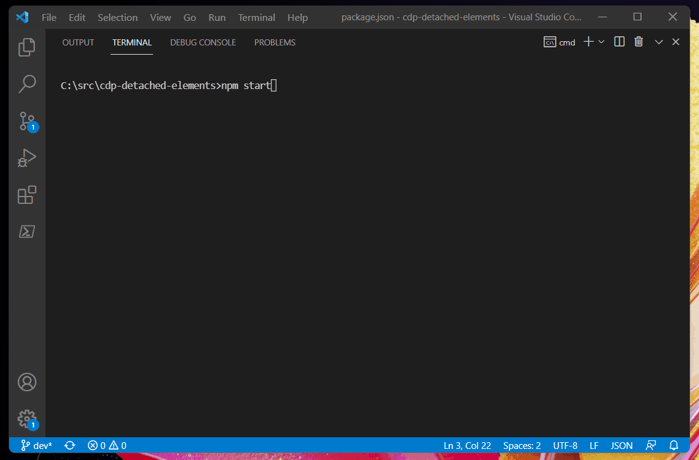

# Detached Elements via CDP

This sample app uses Selenium and Edge Driver to call CDP directly and get the number of detached elements in a webpage.

## Pre-requisites
Have Edge Driver available in `PATH`. Or you can download the Canary version from the official site, extract the contents and copy the executable to the root of this folder.
https://developer.microsoft.com/en-us/microsoft-edge/tools/webdriver/

## How to install and use
`npm install`

`npm start`

___
### More documentation:
https://docs.microsoft.com/en-us/microsoft-edge/webdriver-chromium/?tabs=javascript

https://www.npmjs.com/package/selenium-webdriver

